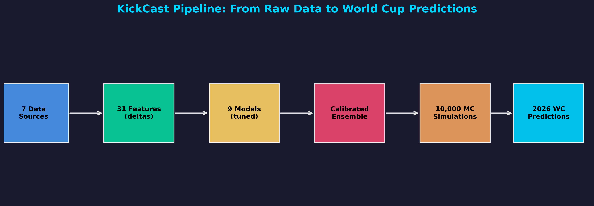
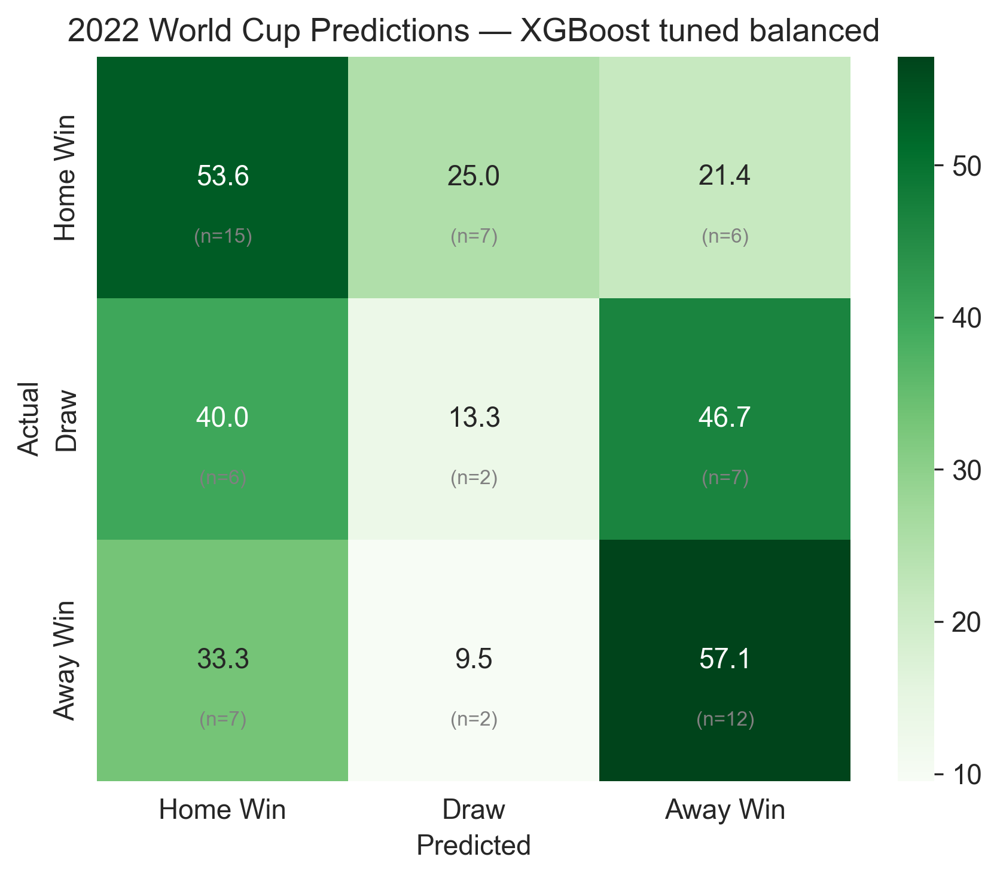

# KickCast

**Predicting the 2026 FIFA World Cup with calibrated match probabilities, an ensemble model zoo, and 10,000-run Monte-Carlo simulation.**

EECE 5644 (Intro to Machine Learning), Northeastern University, Spring 2026.
Team: Karim Semaan & Ramzi Zeineddine.

Live dashboard: <https://kickcast-dashboard.vercel.app>

---

## The honest headline

On the 64 matches of the 2022 World Cup holdout, our best model gets **29/64 = 45.3% top-1 accuracy**. That sits at the always-pick-home baseline (~44%) and below a naive pick-the-Elo-favorite rule (~52%).

So why build any of this? Because top-1 accuracy is the wrong objective for tournament simulation, and the project is explicit about that:

- A favorite-picking baseline never predicts a draw. Our models do, and draws are ~25% of international football. Predicting draws costs top-1 accuracy by construction.
- What the Monte-Carlo simulation actually consumes is the **full 3-class probability vector** per match, so the objective we optimize and report is **log-loss (a proper scoring rule) and calibration**, not argmax accuracy.
- The failure mode we designed against is real: our highest-accuracy model (stacking ensemble, 61.2% validation accuracy) had the **worst** macro-F1 (0.465) because it nearly ignores draws (3% draw recall). High accuracy is not a good model here.

This 45% range is consistent with the published state of the art for 3-class football match prediction. The interesting engineering is in the calibration, the leakage-safe evaluation, and the simulation layer on top.

## What it does

1. **Data**: ~50k international matches (1872 onward), live Elo ratings, FIFA rankings, Transfermarkt market values, manager records, and injury histories (sources and licensing in [`data/README.md`](data/README.md)).
2. **Feature engineering**: 25+ home-minus-away delta features over a **21,371-match × 38-column matrix**, with strictly chronological train/validation/test splits (test = the 2022 World Cup onward) so nothing from the future leaks into training.
3. **Model zoo**: Logistic Regression, KNN, Random Forest, XGBoost, HistGradientBoosting, SVM-RBF, a stacking ensemble, LightGBM/CatBoost variants, and **KickCastNet**, a custom PyTorch net (feature tokenizer + self-attention + residual MLP), tuned with **Optuna**. Class imbalance handled with balanced sample weights (SMOTE was tried and lost).
4. **Explainability**: SHAP attribution. Elo difference is the single strongest predictor (|r| = 0.504 with the target).
5. **Simulation**: calibrated 3-class probabilities drive a **10,000-iteration Monte-Carlo simulation** of the full 48-team, 104-match 2026 World Cup (Poisson goal sampling, group tiebreakers, third-place advancement, knockout bracket with a penalty-shootout model), producing per-team advancement odds.



## Results

Validation-set comparison (full table in `outputs/model_artifacts/results_summary.csv` and `enhanced_results_summary.csv`; test-set tables in `test_results.csv` / `enhanced_test_results.csv`):

| Model | Accuracy | Macro F1 | Log loss | Draw recall |
|---|---|---|---|---|
| LightGBM (tuned, balanced) | 57.1% | **0.538** | 0.904 | 36.0% |
| CatBoost (tuned, balanced) | 56.7% | 0.537 | 0.896 | 37.3% |
| XGBoost (tuned, balanced) | 57.4% | 0.516 | 1.003 | 25.7% |
| HistGBM (tuned, balanced) | 54.6% | 0.509 | **0.919** | 30.9% |
| Stacking ensemble | **61.2%** | 0.465 | 0.860 | 3.0% |
| Logistic Regression | 60.9% | 0.456 | 0.863 | 1.8% |

Read that table top to bottom and the story is the whole project: the models with the best accuracy and log-loss get there by refusing to predict draws. The balanced models trade a few accuracy points for a usable draw class, which is what the simulation needs.

Expanding-window cross-validation (`timeseries_cv_results.csv`) shows the model improving monotonically as training data grows: log-loss 1.172 (train to 2010) → 1.000 (train to 2022).

2022 World Cup holdout confusion matrix:



Sample tournament output (10,000 iterations, `outputs/simulation_results/win_probabilities.csv`): Spain 16.5%, Argentina 11.5%, Brazil 11.3%, France 10.4% to win the 2026 World Cup.

## How to run

```bash
git clone <this-repo>
cd kickcast
python -m venv .venv && source .venv/bin/activate   # or .venv\Scripts\activate on Windows
pip install -r requirements.txt

# Kaggle API credentials required for the data download:
# place kaggle.json in ~/.kaggle/ (https://www.kaggle.com/docs/api)

# 1. Rebuild the data (raw data is NOT checked in; see data/README.md)
python data/scripts/01_download_data.py
python data/scripts/02_build_features.py
python data/scripts/03_create_splits.py

# 2. Train and evaluate (~5 min for the classical zoo)
python notebooks/02_model_training.py
python notebooks/03_model_evaluation.py

# 3. Simulate the tournament and explain the model
python notebooks/04_world_cup_simulation.py
python notebooks/05_shap_analysis.py

# Optional: interactive dashboard
streamlit run dashboard.py
```

Notebook versions (`notebooks/*.ipynb`) mirror the scripts for exploratory reading.

## Repository layout

```
data/
  raw/world_cup_2026/   # 2026 groups, fixtures, bracket, venues (checked in)
  scripts/              # download → features → splits (rebuilds everything else)
notebooks/              # EDA, training, evaluation, simulation, SHAP, model iterations
src/                    # models.py (zoo), simulation.py (Monte Carlo), kickcast_net*.py
tests/                  # simulation unit tests
scripts/                # sim-input + dashboard-data builders
outputs/
  model_artifacts/      # metric CSVs + Optuna best-hyperparameter configs
  simulation_results/   # advancement/win probability CSVs
  figures/              # key result figures
reports/final_report.pdf
MODEL_CARD.md
LESSONS.md              # honest post-mortem: what worked, what did not
```

Trained model binaries (up to 307 MB) are not checked in; retrain with `notebooks/02_model_training.py`.

## Limitations

- **Draws stay hard.** Best draw recall is roughly 26-37% depending on model and split. Draws have no distinctive feature signature; a two-stage win/not-win decomposition did not beat the direct 3-class model. This matches the academic literature.
- **Upsets are structural.** The model gave Argentina a 97% win probability against Saudi Arabia in 2022. The biggest upset in World Cup history happened anyway. One-off tournament football has irreducible randomness.
- **Injury features added noise.** SHAP ablation showed removing 9 of 31 features (mostly injury and match-importance flags) slightly improved performance; the historical injury data is sparse.
- **Calibration is good, not perfect.** See `outputs/figures/12_calibration_plots.png`. Isotonic recalibration and backtesting more tournaments are the obvious next steps.

See [`MODEL_CARD.md`](MODEL_CARD.md) for intended use and a fuller risk discussion, and [`LESSONS.md`](LESSONS.md) for the unvarnished post-mortem.

## License

MIT (code). Raw datasets are not redistributed here; each source keeps its own license (see `data/README.md`).

---

## Provenance & development history

This repository is the **curated public release** (June 2026) of the project: pipeline,
model zoo, notebooks, result CSVs, figures, and model card, published as a single squashed
commit once the team had authorization to open the work.

The **original incremental development** happened during the Spring 2026 course in
[`karimsemaan/KickCaster`](https://github.com/karimsemaan/KickCaster) (April 2026 —
notebooks, `src/`, cached outputs, with the real commit-by-commit history), plus the
course working environment. The follow-up
[calibration study](https://achievements-portfolio.vercel.app/work/kickcast-calibration)
(per-class isotonic recalibration on the 2022 WC holdout) was run against this repo's
saved `XGBoost_tuned_balanced` artifact and is documented with before/after reliability
diagrams and a PDF report.
